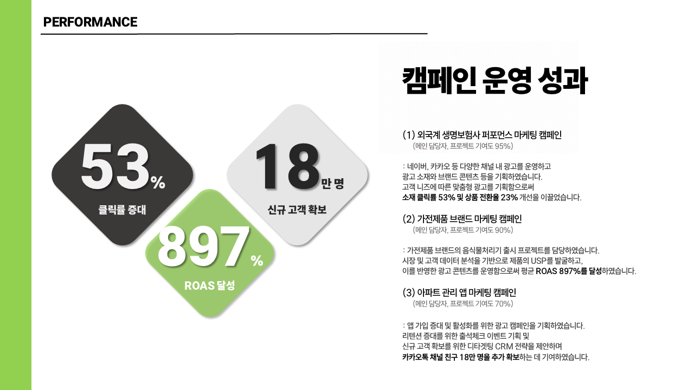

# 포트폴리오_심효진
 
 

<h3 align="center">📊 Marketing Platforms : 매체 운영 📊</h3>

  
  
  

 
<h3 align="center">✨ Tech Stack : 데이터 처리 및 개발 ✨</h3>

  
  
  

 
<h3 align="center">🛠 Tools : 데이터 분석·BI·오피스 🛠</h3>

  
  

  
  

  
  
  

 

<h3 align="center">📍 캠페인 운영 성과 포트폴리오 </h3>
 

  

 

 
 

<h3 align="center">📫 Contact 📫</h3>

  
  

